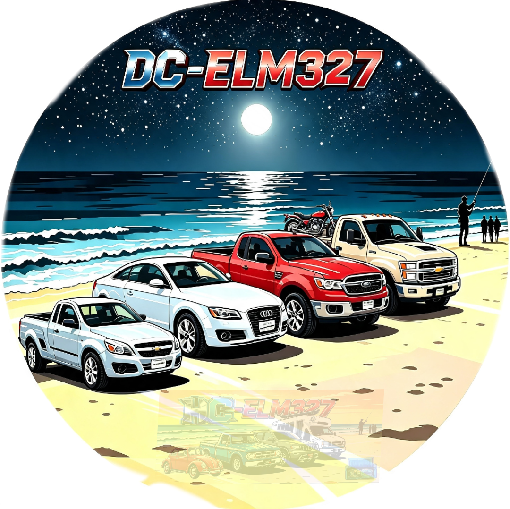

# DC-carECU 🚗🔧

  
  

🔗 [Página oficial](https://dcg0.github.io/DC-carECU/)

## 🌅 Descripción

Tu vehículo y tú listos para cualquier camino. **DC-carECU** transforma tu celular en un escáner profesional que conecta con la computadora de tu auto mediante el adaptador **ELM327** por Bluetooth.

Tu auto en la palma de tu mano, a donde quiera que vayas.

## ✨ Características

- **Monitoreo en vivo:** RPM, temperatura, velocidad, carga del motor y presión de combustible en tiempo real.
- **Diagnóstico completo:** lectura y borrado de códigos de falla del tablero.
- **Mantenimiento avanzado:** reinicios de aceite, frenos, inyectores, filtro DPF y más.
- **Terminal interactiva:** prueba la conexión ECU paso a paso desde la página.
- **Compatibilidad Android:** aplicación optimizada para Android 9 o superior.
- **Conexión simple:** empareja el adaptador ELM327 por Bluetooth y comienza.

## 📲 Cómo usar

1. Conecta el módulo ELM327 al puerto OBD2 de tu auto.
2. Empareja el adaptador por Bluetooth con tu celular.
3. Abre la aplicación y consulta los datos de tu motor.

## 📦 Descargas de APK

### 1. DC-ELM327 Debug

APK de depuración con Bluetooth/BLE, USB, Wi‑Fi/red, modo Demo, datos en vivo, gráficas, dashboard, HUD, códigos DTC, exportación CSV y soporte de plugins.

- [Descargar DC-ELM327-debug.apk](https://github.com/dcg0/DC-ELM327/releases/download/v2.7.10-debug/DC-ELM327-debug.apk)
- [Ver repositorio DC-ELM327](https://github.com/dcg0/DC-ELM327)

### 2. DC-ELM327 HC

Versión con Bluetooth clásico SPP/BLE, escaneo de adaptadores, sensores OBD-II, terminal AT, diagnóstico DTC y reporte PDF.

- [Descargar app-release.apk](https://github.com/dcg0/DC-elm327HC/releases/download/v0.1.0/app-release.apk)
- [Ver release v0.1.0](https://github.com/dcg0/DC-elm327HC/releases/tag/v0.1.0)
- [Ver repositorio DC-elm327HC](https://github.com/dcg0/DC-elm327HC)

### 3. DCecuelm327 Debug

Construcción debug alternativa para diagnóstico ELM327.

- [Descargar androbd-debug.apk](https://github.com/dcg0/DCecuelm327/releases/download/build-1/androbd-debug.apk)
- [Ver release build-1](https://github.com/dcg0/DCecuelm327/releases/tag/build-1)
- [Ver repositorio DCecuelm327](https://github.com/dcg0/DCecuelm327)

## 📂 Archivos incluidos

| Archivo | Descripción |
|---|---|
| `1.png` | Logo/portada principal de día |
| `2.png` | Portada de playa nocturna |
| `3.png` | Logo nocturno |
| `portada.png` | Imagen oficial del proyecto |
| `portadanoche.png` | Portada nocturna usada en la página |
| `abajo1.png` | Pantalla de conexión y datos |
| `abajo2.png` | Funciones y herramientas |
| `qrqr.png` | Código QR de descarga directa |
| `ecu-night-drive.mp3` | Música original retro de fondo |
| `index.html` | Página web completa del proyecto |

## 🌐 Enlaces

- [Página web](https://dcg0.github.io/DC-carECU/)
- [Repositorio principal](https://github.com/dcg0/DC-carECU)
- [Tres APKs en la página de descargas](https://dcg0.github.io/DC-carECU/#descargas)
