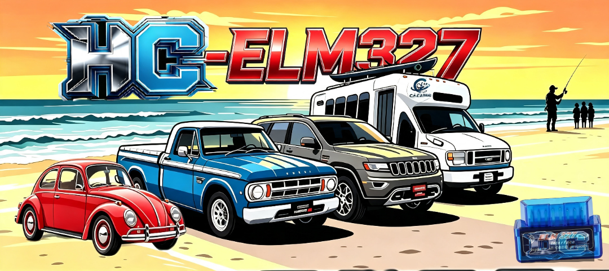

# DC-carECU 🚗🔧
🔗https://dcg0.github.io/DC-carECU/
---
## 🖼️

---

## 🌅 Descripción

En la orilla de la playa, bajo un cielo dorado del atardecer, tu vehículo y tú listos para cualquier camino. **DC-carECU** transforma tu celular en un escáner profesional que conecta con la computadora de tu auto mediante el adaptador **ELM327** por Bluetooth.

Tu auto en la palma de tu mano, a donde quiera que vayas. 🌊🚗

---
https://dcg0.github.io/DC-carECU/
## ✨ Características

- 📊 **Monitoreo en vivo** — RPM, temperatura, velocidad, carga del motor, presión de combustible… todo en tiempo real
- ⚠️ **Diagnóstico completo** — lee y borra códigos de falla del tablero
- 🔧 **Mantenimiento avanzado** — reinicios de aceite, frenos, inyectores, filtro DPF y más
- 🎮 **Simulador interactivo** — prueba la conexión ECU paso a paso desde la página
- 📱 **Para Android 9+** — optimizada y ligera, funciona perfecto en tu ZTE
- 🔗 **Conexión simple** — emparejas por Bluetooth → listo

---

## 📲 Cómo usar

1. Conecta el módulo ELM327 al puerto OBD2 de tu auto
2. Empareja por Bluetooth con tu celular
3. Abre **DC-carECU** y ve todo lo que tu motor te dice

---

## 📂 Archivos incluidos

| Archivo | Descripción |
|---|---|
| `portada.png` | Imagen oficial del proyecto |
| `abajo1.png` | Pantalla de conexión y datos |
| `abajo2.png` | Funciones y herramientas |
| `qrqr.png` | Código QR de descarga directa |
| `index.html` | Página web completa del proyecto |

---

> *"Libertad para conocer tu vehículo, siempre y en cualquier lugar"*

© 2026 DC-carECU · dcg0
